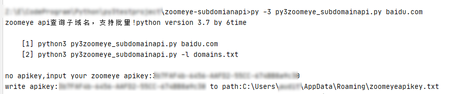
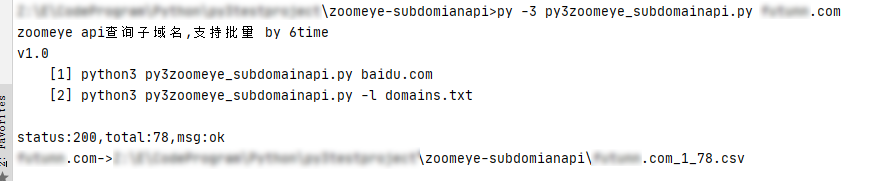
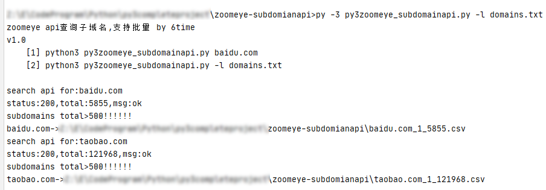
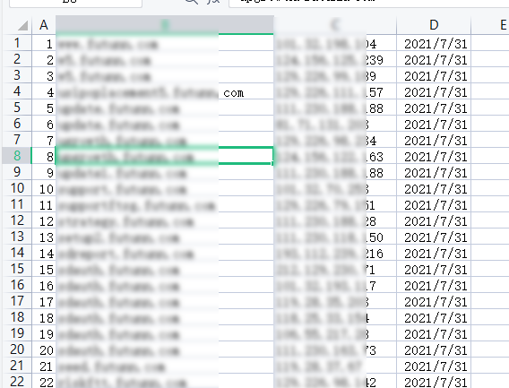

# py3zoomeye_subdomainapi
 zoomeye钟馗之眼子域名查询api脚本，版本v2.0

使用方法

    [1] python3 py3zoomeye_subdomainapi.py -d baidu.com    #单个域名查询
    [2] python3 py3zoomeye_subdomainapi.py -l domains.txt  #批量域名查询
    [3] python3 py3zoomeye_subdomainapi.py -t 0 -d baidu.com    #查询指定类型

第一次执行会要求输入apikey，windows保存在当前用户appdata路径下，linux保存在当前用户目录下，macos系统自行修改源码里的系统判断条件（没钱买本，测试不了）

默认进行子域名查询（关联域名请指定type值），查询结果自动保存到csv文件，命名：[域名]-[类型]-[总数].csv

批量查询

导出结果样式，与zoomeye web界面导出的txt类似

v2.0更新（不再更新）：

1、支持linux系统，优化脚本运行流程，~~添加多线程（加快批量查询速度）~~

2、支持关联域名查询，~~并和子域名查询合并去重~~

~~3、支持ip存活校验，并支持对常见端口进行存活探测~~

~~4、支持简单的web存活探测（存活、状态、标题）~~
